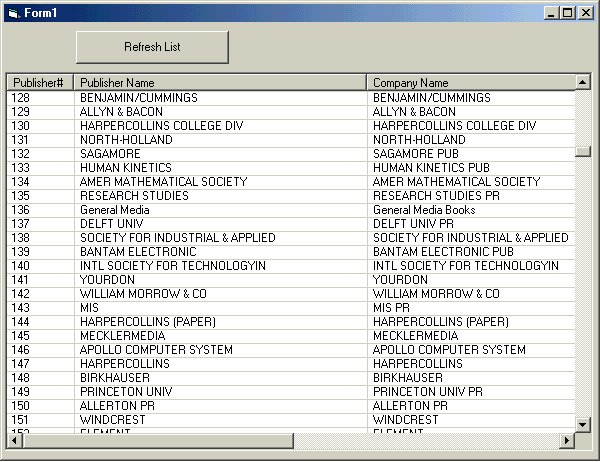



## Simple DBgrid using listview control

### Description

Lists records into a listview control using basic SQL Statements.
 
### More Info
 
Make sure you have the C:\Program Files\Microsoft Visual Studio\VB98\BIBLIO.MDB in the correct path.

couple of bugs in saving some records

             |
---                |---
**Submitted On**   |2000-09-21 22:09:10
**By**             |[Chris Hatton](https://github.com/Planet-Source-Code/PSCIndex/blob/master/ByAuthor/chris-hatton.md)
**Level**          |Intermediate
**User Rating**    |4.8 (29 globes from 6 users)
**Compatibility**  |VB 6\.0
**Category**       |[Databases/ Data Access/ DAO/ ADO](https://github.com/Planet-Source-Code/PSCIndex/blob/master/ByCategory/databases-data-access-dao-ado__1-6.md)
**World**          |[Visual Basic](https://github.com/Planet-Source-Code/PSCIndex/blob/master/ByWorld/visual-basic.md)
**Archive File**   |[CODE\_UPLOAD100379212000\.zip](https://github.com/Planet-Source-Code/chris-hatton-simple-dbgrid-using-listview-control__1-11583/archive/master.zip)

### API Declarations

NONE!

